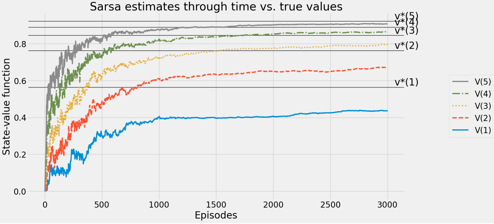

# SARSA LEARNING ALGORITHM

## AIM:
To develop a Python program to find the optimal policy for the given RL environment using SARSA-Learning and compare the state values with the Monte Carlo method.

## PROBLEM STATEMENT:
The bandit slippery walk problem is a reinforcement learning problem in which an agent must learn to navigate a 7-state environment in order to reach a goal state. The environment is slippery, so the agent has a chance of moving in the opposite direction of the action it takes.

### STATE:
The environment has 7 states:
* Two Terminal States: **G**: The goal state & **H**: A hole state.
* Five Transition states / Non-terminal States including  **S**: The starting state.

### ACTIONS:
The agent can take two actions:

* R: Move right.
* L: Move left.

### TRANSITION PROBABILITIES:
The transition probabilities for each action are as follows:

* **50%** chance that the agent moves in the intended direction.
* **33.33%** chance that the agent stays in its current state.
* **16.66%** chance that the agent moves in the opposite direction.

For example, if the agent is in state S and takes the "R" action, then there is a 50% chance that it will move to state 4, a 33.33% chance that it will stay in state S, and a 16.66% chance that it will move to state 2.

### REWARDS:
The agent receives a reward of +1 for reaching the goal state (G). The agent receives a reward of 0 for all other states.

### GRAPHICAL REPRESENTATION:


## SARSA LEARNING ALGORITHM:
1. Initialize the Q-values arbitrarily for all state-action pairs.
2. Repeat for each episode:
    1. Initialize the starting state.
    2. Repeat for each step of episode:
        1. Choose action from state using policy derived from Q (e.g., epsilon-greedy).
        2. Take action, observe reward and next state.
        3. Choose action from next state using policy derived from Q (e.g., epsilon-greedy).
        4. Update Q(s, a) := Q(s, a) + alpha * [R + gamma * Q(s', a') - Q(s, a)]
        5. Update the state and action.
    3. Until state is terminal.
3. Until performance converges.

## SARSA LEARNING FUNCTION:
```
Name : Paarkavy B
Reg No : 212221230072
```

```
def sarsa(env,
          gamma=1.0,
          init_alpha=0.5,
          min_alpha=0.01,
          alpha_decay_ratio=0.5,
          init_epsilon=1.0,
          min_epsilon=0.1,
          epsilon_decay_ratio=0.9,
          n_episodes=3000):
    nS, nA = env.observation_space.n, env.action_space.n
    pi_track = []
    Q = np.zeros((nS, nA), dtype=np.float64)
    Q_track = np.zeros((n_episodes, nS, nA), dtype=np.float64)

    select_action = lambda state,Q,epsilon: 
    			np.argmax(Q[state]) 
    			if np.random.random() > epsilon 
                else np.random.randint(len(Q[state]))

    alphas = decay_schedule(init_alpha,min_alpha,alpha_decay_ratio,n_episodes)

    epsilons = decay_schedule(init_epsilon,min_epsilon,epsilon_decay_ratio,n_episodes)

    for e in tqdm(range(n_episodes),leave=False):
        state, done = env.reset(), False
        action = select_action(state,Q,epsilons[e])

        while not done:
            next_state,reward,done,_ = env.step(action)
            next_action = select_action(next_state,Q,epsilons[e])

            td_target = reward+gamma*Q[next_state][next_action]*(not done)

            td_error = td_target - Q[state][action]

            Q[state][action] = Q[state][action] + alphas[e] * td_error

            state, action = next_state,next_action

        Q_track[e] = Q
        pi_track.append(np.argmax(Q,axis=1))

    V = np.max(Q,axis=1)
    pi = lambda s: {s:a for s,a in enumerate(np.argmax(Q,axis=1))}[s]

    return Q, V, pi, Q_track, pi_track

```

## OUTPUT:
### OPTIMAL STATE VALUE FUNCTIONS:


### OPTIMAL ACTION VALUE FUNCTIONS:


### FIRST VISIT MONTE CARLO ESTIMATES:


### SARSA ESTIMATES:


## RESULT:
Thus, the optimal policy for the given RL environment is found using SARSA-Learning and the state values are compared with the Monte Carlo method.
